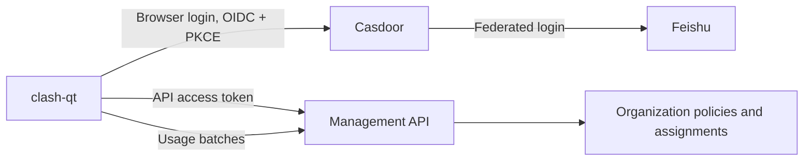

# Managed configuration and network integration architecture

Status: proposal, 2026-09-20. These features are not implemented by this document.

Implementation dispatch follows the [parallel roadmap](IMPLEMENTATION_ROADMAP.md)
and [sub-agent ownership/dependency plan](PARALLEL_EXECUTION_PLAN.md). The local
phases below describe feature scope, not a separate execution order.

[Project goals G1–G6](PROJECT_GOALS.md) strengthen the foundation requirements:
build local mihomo, publish a separate COM/component boundary, provide Make commands,
preserve legacy-v1, refresh docs on refactor cutover, and qualify native OS packages.
The portable COM model follows `3rdparty/ref/fxcom` without FX names; Windows-native
COM is an optional bridge. [G7/G8 and the capture plan](CAPTURE_MODULE_PLAN.md) add
containerized app monitoring and local-source mitmproxy inspection/scheduled capture.

## Direction

Keep clash-qt useful as a standalone desktop client. Add optional organization
management and network integrations around a shared configuration and lifecycle
layer. A user can supply a local preset, enroll with a management service, or use
both within the organization's allowed settings.

Use Casdoor for identity, a separate management API for proxy policy and usage,
and provider modules for Tailscale and school VPNs. Start with compiled modules
behind small interfaces. Add external process plugins once two real integrations
have established the contracts; avoid committing to a native C++ plugin ABI now.

## Current implementation and extraction points

| Existing code | Useful behavior | Proposed change |
| --- | --- | --- |
| `src/core/profile/profile_store.cpp`, `buildRuntime` | Profile loading, enhancement, overrides, immutable runtime files | Extract pure configuration composition; leave profile persistence and subscription refresh in ProfileStore |
| `src/core/enhance/config_enhancer.cpp` | Global YAML merges and bounded JavaScript transformations | Adapt as explicit pipeline stages; add global and per-profile preset scopes |
| `src/core/process/core_process.cpp` | Asynchronous validation, process/service lifecycle, controller readiness | Retain as the mihomo backend behind a runtime coordinator |
| `src/platform/proxy/system_proxy_service.cpp` | Serialized proxy changes and restoration of owned settings | Use as the OS proxy adapter for network plans |
| `src/platform/service/` and `src/service/macos_helper.mm` | Privileged-service work exists in the current working tree | Keep narrow privileged operations; do not host general plugins here |
| `src/main.cpp`, `src/ui/main_window.cpp`, `src/ui/routing_controls.cpp` | Runtime reload and routing coordination distributed across app/UI | Move orchestration and policy checks into application services |
| `src/core/traffic_history.*`, `src/core/mihomo_client.cpp` | Bounded rate history and controller connection totals | Add a separate durable usage collector with explicit coverage |

The current enhancement merge is recursive and replaces sequences; runtime
overrides merge only one nested map level. Preserve these legacy behaviors during
extraction. New versioned presets can use the explicit merge semantics below.
The README's service limitations lag work in the current source; implementation
and native validation must determine actual service support.

## Module boundaries

```text
src/core/config/          Composition, operations, provenance, local presets
src/core/policy/          Constraints, editable paths, enrollment state
src/core/network/         Observations, requirements, conflict detection, plans
src/app/                  RuntimeCoordinator, SessionManager, UsageCollector
src/integrations/identity/ Generic OIDC client and Casdoor configuration
src/integrations/management/ Remote policy, enrollment and usage transports
src/integrations/network/  Tailscale and EasyConnect adapters
src/platform/             Keychain, processes, routes, DNS, proxy, privilege
src/extensions/           Registry; later, external plugin protocol
src/ui/                   Pages and view models calling application services
src/core/capture/         Capture contracts, metadata catalog and export
src/app/capture/          App targets, capture lifecycle and schedules
src/integrations/capture/ Monitor and mitmproxy component adapters
src/platform/capture/    Native observation/targeting adapters
src/platform/trust/      Explicit owned certificate/trust operations
src/services/capture/    Supervised Python worker bridge
services/monitor/        Containerized metadata backend (repository root)
```

Domain code uses value objects and has no QWidget, process, filesystem, or HTTP
dependencies. Qt Core types are acceptable; avoiding Qt entirely is unnecessary.
Application services depend on narrow interfaces. Integrations implement those
interfaces and receive only their required dependencies. UI code cannot issue
unmediated policy-sensitive controller changes.

Each module becomes a CMake target with explicit public dependencies and its own
tests. Reuse existing classes through adapters and temporary forwarding methods;
do not rewrite the working application all at once or build a general service
locator. `app::Context` remains the composition boundary for the UI.

Initial contracts, expressed as operations rather than fixed C++ signatures:

| Contract | Input / output |
| --- | --- |
| IdentityProvider | Begin/cancel login, refresh, logout → verified session |
| PolicySource | Session/device and cached revision → policy envelope |
| ConfigComposer | Immutable profile/layers/constraints → candidate + provenance + diagnostics |
| NetworkIntegration | Probe → observations; plan(snapshot, settings) → requirements |
| ManagedIntegration | Prepare/start/stop/status → owned resource handles |
| NetworkPlanner | All requirements + policy + OS capabilities → plan or conflicts |
| RuntimeCoordinator | Candidate + plan → applied revision or recovery result |
| UsageSink | Idempotent usage batch → acknowledgement |

I/O operations are asynchronous, deadline-bound, cancellable, and tagged with a
generation. Results from an old login, profile, policy, or network state cannot
apply after newer state has superseded them.

## Identity and business management

Recommended login path:



Casdoor documents authorization code with S256 PKCE and optional client secret
when PKCE is used. Its Lark integration is present upstream; verify the deployed
version and organization mapping. Use generic OIDC in the desktop so another
provider can replace Casdoor. See [Casdoor OAuth](https://casdoor.org/docs/how-to-connect/oauth/)
and the upstream [Lark provider change](https://github.com/casdoor/casdoor/issues/4119).

Open the system browser, validate state and nonce, validate issuer/audience/token
signatures and expiry, and use a registered native callback with a short lifetime.
Prefer a loopback callback where the deployment supports it. Never embed a shared
client secret in the desktop. This follows [OAuth for native applications](https://www.rfc-editor.org/info/rfc8252/).
Store refresh tokens in the OS credential store; backups contain credential
references, not tokens. If secure persistence is unavailable, offer session-only
login rather than plaintext fallback.

Direct Feishu login can be a later adapter. Its exact application type and token
exchange requirements need verification before implementation; use a backend
broker when confidential credentials are required. Feishu directory synchronization
and business authorization belong in the management service, not every desktop.

Model organization, member, role/group, device enrollment, preset assignment,
policy revision, and usage batch separately. Identify a person using issuer and
subject plus validated organization membership, not a mutable email address.
One active managed identity per application workspace is sufficient initially.
Logout or tenant switching cancels outstanding work and clears that identity's
credentials and runtime resources according to its enrollment rules.

## Configuration and enforcement

Support three sources through the same pipeline: local user presets, managed
organization policy, and a user-configured remote preset endpoint. The endpoint
does not need Casdoor if it implements the policy protocol with another supported
authentication method. A subscription remains a source profile; refresh never
overwrites a separate preset or the user's original file.

Proposed precedence, from earlier to later:

1. Imported subscription or local base profile.
2. Managed recommended defaults, overriding the subscription where specified.
3. User global presets and the existing global enhancement chain.
4. User per-profile presets and transformations.
5. Explicit user runtime settings.
6. Network-plan contributions, reconciled with user intent and managed constraints.
7. Managed enforced values and mandatory rule blocks.
8. Application-owned controller address, secret, and runtime paths.

After all stages, validate policy constraints, network requirements, proxy/group
references, and the resulting mihomo configuration. Incompatible requirements
produce an actionable conflict; stage order must not silently break another VPN.
Reject policies that attempt to own reserved application fields.

Managed defaults and enforced values are different concepts. Enforced settings
need path locks, value constraints, and protected ordered rule blocks. For example,
a required campus rule must remain before a subscription's catch-all rule, and a
user must not bypass it by switching to Global or Direct mode. Check settings,
tray actions, hotkeys, node selection, scripts, imports, restore, and live controller
PATCH requests at the application-service boundary. Managed mode should require
a managed core; arbitrary external controllers remain standalone connections.

For new preset versions, define operations explicitly: recursive map merge,
replace, remove, prepend/append ordered rules, and upsert named proxies/groups.
Arrays replace unless an operation says otherwise; null is a value rather than an
implicit deletion. Reject duplicate names and dangling references. Namespace
integration-owned resources. Preserve exact rule ordering and source information.
Remote policy is declarative data, never executable enhancement scripts or shell
commands. Existing local scripts run before enforcement.

Expose an effective-config preview with source, locked status, conflicts, and a
redacted diff. Keep separate desired and applied revisions. Prepare dependent VPN
resources, validate the candidate, apply serialized changes, probe health, then
commit. On failure recover the previous compatible configuration and owned
resources. Recovery is compensating work, not an atomic OS transaction; report
partial recovery explicitly and never resurrect revoked managed credentials.

## Remote policy and usage protocol

Define a versioned protocol independently of the backend implementation:

| Proposed endpoint | Purpose |
| --- | --- |
| `POST /v1/devices/enroll` | Bind this installation to an authenticated organization/member |
| `GET /v1/policy` | Effective policy for the authenticated device; conditional requests with ETag |
| `POST /v1/policy/ack` | Desired/applied revision and bounded failure diagnostics |
| `POST /v1/usage/batches` | Durable, deduplicated usage reporting |
| `POST /v1/devices/unenroll` | Release enrollment and revoke its credentials |

The server derives organization and membership from authenticated context, checks
roles on admin actions, and authorizes each device. Client-supplied user IDs never
grant access. Policy envelopes include schema version, tenant/device binding,
monotonic revision, issue/expiry times, editable settings, mandatory settings,
integration grants, and offline behavior. Use authenticated TLS and a verified
signed envelope for cached policy, with an enrollment trust root and key rotation.
An ETag is a cache validator, not a trust or anti-rollback mechanism.

Fetch with timeouts, response-size limits, backoff and jitter. Keep the last valid
policy only within its permitted lifetime. Standalone remains offline-capable;
managed enrollment explicitly declares its grace period and expiry/revocation
behavior. Stopping mihomo alone does not block direct host traffic: strict network
lockdown would require a separately designed and tested firewall/gateway policy.

Usage batches contain device/session identity, core epoch, sequence, interval,
byte deltas, policy revision, and coverage. Collect from supported cumulative
controller counters, handle resets/reconnect gaps, persist a bounded outbox, and
retry with stable batch IDs. Resolve counter semantics for the supported mihomo
version before relying on them. Rate samples in `TrafficHistory` are suitable for
charts, not reliable billing totals.

Attribute usage to the active managed core/session, not arbitrary OS users sharing
the machine. Traffic bypassing mihomo, including excluded Tailscale traffic, is
outside that accounting scope. Default reports omit URLs, DNS queries, and process
details. The management UI must show coverage and gaps. A user-controlled desktop
cannot guarantee tamper-proof reporting or enforcement; hard quotas and authoritative
accounting require per-user credentials and measurement at controlled gateways.

## Tailscale coexistence

The first network module detects an existing installation and observes state.
Use bounded `tailscale status --json` calls plus platform route/DNS observations;
do not infer active routes only from advertised subnet routes. Report installation,
login, connection, exit-node state, relevant routes and DNS, and probe failures
separately. CLI JSON is documented in the [Tailscale CLI reference](https://tailscale.com/kb/1080/cli).

System proxy mode needs OS-specific bypass handling and mihomo rules for traffic
that still reaches its proxy. TUN mode additionally needs route exclusions and
resolver coordination. Discover active tailnet/subnet routes, preserve split DNS
and MagicDNS, and prevent fake-IP interception from hiding private destinations.
Use the actual discovered DNS suffixes and resolver reachability. Verify that
Tailscale's own transport avoids recursive capture.

Tailscale documents its usual IPv4/IPv6 ranges and the need to account for subnet
routes. Its exit-node mode has stronger coexistence restrictions; flag that as an
unsupported combination initially instead of claiming automatic support. See
[Tailscale VPN coexistence](https://tailscale.com/docs/reference/faq/other-vpns).
Overlapping school and tailnet prefixes also require explicit conflict handling.

Generate exclusions only for enabled, observed integrations. Use capability checks
for the installed OS and mihomo version: route exclusion and DNS policy are
separate controls, and some TUN options are Linux-only. See [mihomo TUN](https://wiki.metacubex.one/en/config/inbound/tun/)
and [mihomo DNS](https://wiki.metacubex.one/en/config/dns/).
Keep generated routes/rules in the runtime rather than editing subscriptions.
Reconcile on reconnect, sleep/wake, interface change, and integration removal.

## EasyConnect and school VPNs

Implement a generic container-backed VPN adapter, with Fudan connection settings
as a preset. Verify the current campus gateway, client version, authentication
flow, and authorized resource domains during integration testing; do not hard-code
an assumed working campus setup into the platform layer.

Initially connect to an existing local SOCKS/HTTP endpoint. Then add optional
container lifecycle management with status, start/stop, health, redacted logs, and
an authentication handoff. The upstream project exposes these proxy endpoints
and documents container TUN/network capability requirements in its
[usage guide](https://github.com/docker-easyconnect/docker-easyconnect/blob/master/doc/usage.md).

Send only assigned campus destinations through the container endpoint. Verify
private DNS resolution through the VPN; sending traffic through SOCKS does not
by itself prove that mihomo resolved campus names correctly. Test supported UDP
behavior separately. Prefer this outbound-proxy arrangement before attempting
host-wide route management across Docker Desktop VMs and Linux hosts.

Detect Docker/Podman and architecture support; use a pinned image digest and
explicit capabilities, loopback-bound published ports, and credential references.
Manage only labeled resources created by clash-qt. Present MFA/browser/VNC login
when required rather than assuming password-only automation. Container control
belongs in an unprivileged adapter using authorized runtime access; the privileged
mihomo helper must not become a general Docker or shell executor.

## Extension lifecycle and permissions

Start with built-in registration of small provider modules. External extensions
later implement versioned JSON-RPC over a supervised local process channel, using
the same value contracts. A manifest declares ID, version, protocol version,
supported platforms, configuration schema, dependencies, and requested capabilities.
Lifecycle: discover → validate → probe → prepare → activate → monitor → deactivate.

Plugins propose configuration/network requirements. The host owns composition,
policy validation, credential access, operation ordering, and privileged actions.
No plugin gets the entire `app::Context` or arbitrary root execution. Namespace
contributions, reject dependency cycles and duplicate IDs, bound messages, impose
timeouts, and recover from plugin crashes. Disabling removes contributions on the
next validated transition and stops only resources the plugin owns.

An external process isolates crashes and language/ABI choices, but is not a
security sandbox. Until OS sandboxing is implemented, install only trusted plugins;
capability declarations constrain host APIs but cannot stop ambient process access.
Keep UI contributions declarative initially: settings fields, status, and actions.

## Delivery sequence and acceptance

The capture modules use the same component/runtime/network boundaries, with their
own visibility and trust contracts. Shared target/session/catalog/scheduler services
avoid coupling the passive monitor to TLS decryption. Source-backed constraints,
protocol matrix, storage/export and schedules are in [CAPTURE_MODULE_PLAN.md](CAPTURE_MODULE_PLAN.md).
Use monitor metadata only within its attribution/coverage; do not merge it into
billable usage or claim full URLs from encrypted traffic. Managed policy controls
capture capability and execution scope at the host boundary; remote configuration
cannot silently inject capture scripts or install a CA.

| Phase | Deliverable | Acceptance evidence |
| --- | --- | --- |
| 1 | Extract ConfigComposer and RuntimeCoordinator; add scoped local presets and provenance | Existing runtime fixtures retain behavior; refresh preserves overrides; ordered rules, invalid references, cancellation and recovery covered |
| 2 | Built-in integration registry and Tailscale observation/planning | Absent/logged-out/connected states; read-only probes; conflict diagnostics; native System Proxy and TUN tests before enabling automatic plans |
| 3 | Generic OIDC/Casdoor enrollment and remote policy adapter | PKCE/callback validation, tenant isolation, refresh/logout, expiry, locked-action checks, stale-reply rejection and offline behavior |
| 4 | Durable usage reporting and management API/admin UI | Counter-reset/gap cases, retry deduplication, bounded offline storage, per-device attribution and honest coverage |
| 5 | EasyConnect endpoint adapter, then container management and Fudan preset | Campus DNS/resource tests, authentication handoff, runtime failure, no unrelated-container changes, tested CPU/OS combinations |
| 6 | External plugin protocol and developer example | Second provider implemented without core edits; version mismatch, crash, timeout, permissions and removal tested |

The management API/admin UI is a separate deliverable with member/device/preset
assignment, applied-policy status, usage views, and administrative audit history.
Casdoor supplies identity administration; it does not replace this proxy-specific
service. Choose its implementation stack separately from the C++ desktop.

Native networking acceptance covers macOS, Windows and Linux independently;
System Proxy, TUN and both together; IPv4/IPv6; MagicDNS and private DNS; subnet
routes; exit-node rejection; overlapping prefixes; sleep/wake; container restart;
and failed application/restoration. Use mocks for routine CI and isolated hosts
for real route/DNS tests. Do not claim cross-platform support from macOS alone.

The first implementation slice should be phase 1 plus a read-only Tailscale
provider. This delivers reusable configuration and integration boundaries before
authentication, remote administration, or container orchestration expands scope.
